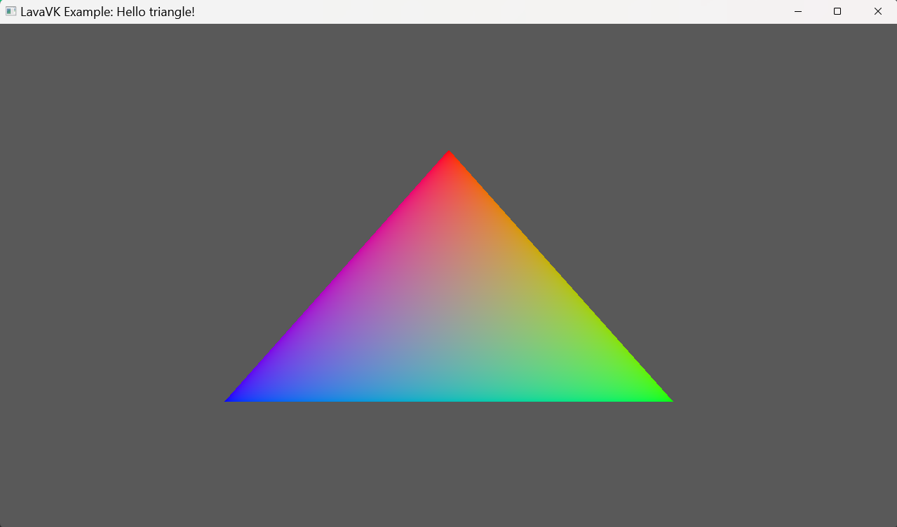

# LavaVK

A modern, user-friendly C++ wrapper around the Vulkan graphics API.

LavaVK is a lightweight C++20 wrapper around Vulkan that removes boilerplate while preserving Vulkan's architecture.

Unlike game engines or rendering frameworks, LavaVK does not impose an engine design. Every Vulkan object remains familiar, but is wrapped in modern RAII classes with sensible defaults, automatic resource management, and a cleaner API.

LavaVK aims to make Vulkan easier to use while keeping the power and flexibility of the original API. It provides clean C++ abstractions for Vulkan objects without forcing a rendering architecture, allowing users to build their own engines, renderers, tools, and applications.

### Why LavaVK?

LavaVK does not attempt to hide Vulkan.

Instead, it removes boilerplate while keeping Vulkan concepts intact.

If you know Vulkan, you already know LavaVK.

There are no custom rendering abstractions or engine architecture imposed on users.

**LavaVK wrote 1000's of lines of code so that you dont have to**

---

## Features

Currently in development.

### Current Features:

- [x] Modern C++20 interface
- [x] Vulkan instance management
- [x] Physical device enumeration and selection
- [x] Logical device creation
- [x] Queue abstraction
- [x] Command buffers
- [x] Swapchain management
- [x] Buffer and image helpers
- [x] Shader management
- [x] Pipeline creation helpers
- [x] Vulkan validation layer support
- [x] Automatic GLSSL → SPIR-V compilation using shaderc
- [x] Supports loading SPIR-V binaries directly
- [x] Compatible with any Window API
- [x] Buffers
---
### Planned Features:
- [ ] Textures
- [ ] Compute Pipelines
- [ ] Descriptor indexing
- [ ] Raytracing
- [ ] Dynamic Rendering
- [ ] Mesh Shaders

---

## Reqirements & dependencies
- Vulkan SDK Download: https://vulkan.lunarg.com/
- shaderc (included in repo)
- GLM (included in repo)
- stbi_image (included in repo)

## Installation
```bash
git clone https://github.com/RanveerisdeGOAT/LavaVK.git
```
### Cmake support
```cmake
project(Example)

add_subdirectory(LavaVK)

add_executable(Example
        main.cpp
)

target_link_libraries(Example
        PRIVATE
        LavaVK::LavaVK
)
```

## Documentation
Visit https://ranveerisdegoat.github.io/LavaVK/html/index.html for full documentation

## Getting started

For this tutorial we are going to use GLFW 3

### Setup GLFW
```c++
constexpr uint32_t WIDTH = 1280;
constexpr uint32_t HEIGHT = 720;

// Initialize GLFW
if (!glfwInit()) {
    std::cerr << "Failed to initialize GLFW\n";
    return -1;
}

glfwWindowHint(GLFW_CLIENT_API, GLFW_NO_API);

GLFWwindow *window = glfwCreateWindow(
    WIDTH, HEIGHT,
    "LavaVK Example: Hello triangle!",
    nullptr, nullptr
);

if (!window) {
    std::cerr << "Failed to create GLFW window\n";
    glfwTerminate();
    return -1;
}
```

### Get application instance.

```c++
uint32_t extensionCount = 0;
const char **glfwExtensions = glfwGetRequiredInstanceExtensions(&extensionCount);

LavaVK::Instance instance({
    .applicationName = "LavaVK Example: Hello triangle!",
    .extensions = std::vector<const char *>(glfwExtensions, glfwExtensions + extensionCount)
});
```

### Create surface.

Creating surfaces depends on your graphics API.

Here is an example for GLFW:
```c++
LavaVK::Surface surface(instance, [window](VkInstance vkInst) -> VkSurfaceKHR {
    VkSurfaceKHR rawSurface = VK_NULL_HANDLE;
    if (glfwCreateWindowSurface(vkInst, window, nullptr, &rawSurface) != VK_SUCCESS) {
        return VK_NULL_HANDLE;
    }
    return rawSurface;
});
```

SDL:
```c++
LavaVK::Surface surface(instance, [sdlWindow](VkInstance vkInst) -> VkSurfaceKHR {
    VkSurfaceKHR rawSurface = VK_NULL_HANDLE;
    if (!SDL_Vulkan_CreateSurface(sdlWindow, vkInst, &rawSurface)) {
        return VK_NULL_HANDLE;
    }
    return rawSurface;
});
```

WIN32:
```c++
#include <vulkan/vulkan_win32.h>

LavaVK::Surface surface(instance, [hwnd, hinstance](VkInstance vkInst) -> VkSurfaceKHR {
    VkWin32SurfaceCreateInfoKHR createInfo{};
    createInfo.sType     = VK_STRUCTURE_TYPE_WIN32_SURFACE_CREATE_INFO_KHR;
    createInfo.hwnd      = hwnd;      // HWND handle to your Win32 window
    createInfo.hinstance = hinstance; // HINSTANCE of your application process

    VkSurfaceKHR rawSurface = VK_NULL_HANDLE;
    if (vkCreateWin32SurfaceKHR(vkInst, &createInfo, nullptr, &rawSurface) != VK_SUCCESS) {
        return VK_NULL_HANDLE;
    }
    return rawSurface;
});
```

Wayland:
```c++
#include <vulkan/vulkan_wayland.h>

LavaVK::Surface surface(instance, [wlDisplay, wlSurface](VkInstance vkInst) -> VkSurfaceKHR {
    VkWaylandSurfaceCreateInfoKHR createInfo{};
    createInfo.sType   = VK_STRUCTURE_TYPE_WAYLAND_SURFACE_CREATE_INFO_KHR;
    createInfo.display = wlDisplay; // Pointer to wl_display
    createInfo.surface = wlSurface; // Pointer to wl_surface

    VkSurfaceKHR rawSurface = VK_NULL_HANDLE;
    if (vkCreateWaylandSurfaceKHR(vkInst, &createInfo, nullptr, &rawSurface) != VK_SUCCESS) {
        return VK_NULL_HANDLE;
    }
    return rawSurface;
});
```

### Create device.
Select your GPU first, note that `LavaVK::GPUHardware::selectOptimalGPU` does not chose the best GPU, it just selects descrete GPU's over integrated.
```c++
// GPU Selection & Device Creation
const auto &selectedGPU = LavaVK::GPUHardware::selectOptimalGPU(instance, surface);

// Device automatically creates command pools for all passed QueueTypes
LavaVK::Device device(
    selectedGPU,
    {LavaVK::QueueType::GRAPHICS, LavaVK::QueueType::PRESENT},
    &surface
);
```

### Create graphics pipeline.

```c++
auto setLayout = LavaVK::DescriptorSetLayout::Builder(device)
        .addBinding(0, LavaVK::DescriptorType::UniformBuffer, LavaVK::STAGE_VERTEX_BIT)
        .addBinding(1, LavaVK::DescriptorType::CombinedImageSampler, LavaVK::STAGE_FRAGMENT_BIT)
        .build();

// Pipeline Layout
LavaVK::PushConstantRange pushConstantRange{
    .stageFlags = LavaVK::STAGE_VERTEX_BIT,
    .offset = 0,
    .size = 64
};

std::vector<const LavaVK::DescriptorSetLayout *> layouts = {setLayout.get()};
std::vector<LavaVK::PushConstantRange> pushConstants = {pushConstantRange};

LavaVK::PipelineLayout pipelineLayout(device, layouts, pushConstants);

// Render Pass
LavaVK::RenderPass renderPass(device, LavaVK::Format(LavaVK::ChannelOrder::BGRA, LavaVK::BitDepth::B8, LavaVK::NumericType::Srgb),
    LavaVK::Format(LavaVK::ChannelOrder::D, LavaVK::BitDepth::B32, LavaVK::NumericType::Float));
```

### Create graphics pipeline.

```c++
// Note: If your using glsl, you don't need to compile to SPIR-V
// because LavaVK automatically compiles it you you.
LavaVK::Shader vertexShader(device, "../shader/tri.vert");
LavaVK::Shader fragmentShader(device, "../shader/tri.frag");

LavaVK::GraphicsPipeline pipeline(
    device,
    {
        .vertexShader = &vertexShader,
        .fragmentShader = &fragmentShader,

        .layout = &pipelineLayout,
        .renderPass = &renderPass,

        .topology = LavaVK::Topology::TRIANGLES,

        .polygonMode = LavaVK::PolygonMode::FILL,
        .cullMode = LavaVK::CullMode::NONE,
        .frontFace = LavaVK::FrontFace::COUNTER_CLOCKWISE,

        .depthTest = true,
        .depthWrite = true,

        .blending = false
    });
```

### Program shaders.

Vertex shader:
```glsl
#version 450

// Hardcoded vertex positions for a triangle
vec2 positions[3] = vec2[](
vec2(0.0, -0.5),
vec2(0.5, 0.5),
vec2(-0.5, 0.5)
);

// Hardcoded colors per vertex (RGB)
vec3 colors[3] = vec3[](
vec3(1.0, 0.0, 0.0), // Red
vec3(0.0, 1.0, 0.0), // Green
vec3(0.0, 0.0, 1.0)  // Blue
);

// Output passed to the fragment shader
layout(location = 0) out vec3 fragColor;

void main() {
    gl_Position = vec4(positions[gl_VertexIndex], 0.0, 1.0);
    fragColor = colors[gl_VertexIndex];
}
```

Fragment shader:
```glsl
#version 450

// Input interpolated from the vertex shader
layout(location = 0) in vec3 fragColor;

// Output color written to the framebuffer
layout(location = 0) out vec4 outColor;

void main() {
    outColor = vec4(fragColor, 1.0);
}
```

### Create swapchain.

```c++
LavaVK::SwapChain swapchain(
        device,
        surface,
        renderPass,
        renderPass.getColorFormat(),
        renderPass.getDepthFormat(),
        {WIDTH, HEIGHT}
    );
```

### Create command buffers.

Because LavaVK::device automatically create a command pool, all you need to do is allocate your desired command buffers.
```c++
// Allocates the max amount of command buffers for every swapchain framebuffer
device.getCommandPool(LavaVK::QueueType::GRAPHICS).allocate(LavaVK::MAX_FRAMES_IN_FLIGHT); 
```

### Acquire swapchain image.

```c++
while (!glfwWindowShouldClose(window)) {
    glfwPollEvents();

    // Acquire Next Swapchain Image
    uint32_t imageIndex = 0;
    LavaVK::Result acquireResult = swapchain.acquireImage(imageIndex);

    // If fails means that the window probably resized
    if (!acquireResult) {
        swapchain.recreate();
        continue;
    }

    size_t frameIndex = swapchain.currentFrame();
}
```

### Record command buffers.
In LavaVK all you need is to pass a function of what you want to do
LavaVK will handle the rest

```c++
// Retrieve & Record Command Buffer from device's command pool
LavaVK::CommandBuffer& cmdBuffer = device.getCommandPool(LavaVK::QueueType::GRAPHICS).retrieve(frameIndex);
cmdBuffer.record(
    renderPass,
    swapchain.framebuffer(imageIndex),
    swapchain.extent(),
    [&](LavaVK::CommandBuffer& cmd) {
        cmd.bindPipeline(pipeline);
        cmd.draw(3);
    }
);
```

### Submit command buffers to GPU.

```c++
// Submit Command Buffer directly through Device using LavaVK Sync primitives
device.submit(
    LavaVK::QueueType::GRAPHICS,
    frameIndex,
    { swapchain.imageAvailableSemaphore() },              // Wait semaphore
    { LavaVK::PipelineStage::ColorAttachmentOutput },     // Wait stage
    { swapchain.renderFinishedSemaphore(imageIndex) },    // Signal semaphore
    &swapchain.inFlightFence()                             // Fence pointer
);
```

### Present to window.
```c++
// Present
swapchain.present(imageIndex);
```

### Clean shutdown.
Do this when the program should finish
```c++
device.waitIdle();

glfwDestroyWindow(window);
glfwTerminate();

return 0;
```

### Voila, Hello triangle.



## Contributing

Contributions are welcome! Please open an issue before submitting large changes.

---

LavaVK 2026
Author: @RanveerisdeGOAT
Co-Authors: Deepseek, Gemini, ChatGPT ;)
Open source: Free to use, modify and improve: https://github.com/RanveerisdeGOAT?tab=repositories
MIT Licence
